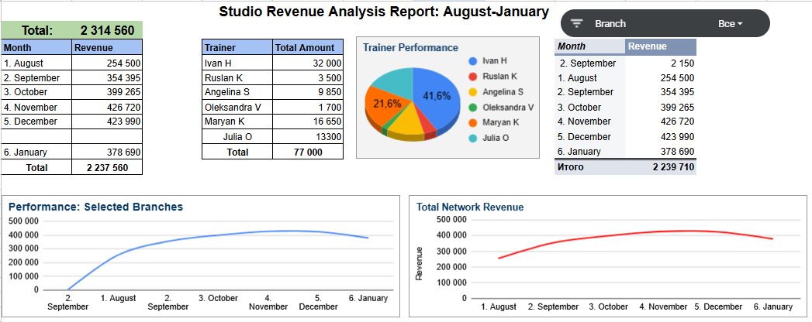

Commercial Performance Analysis: Dance Studio Network (Aug '25 — Jan '26)

This project presents a comprehensive data analysis of 1,500+ transactions from a dance studio network. The primary goal was to transform raw financial data into a functional Business Intelligence (BI) tool to identify revenue drivers, seasonal patterns, and operational risks

Technical Workflow
* Performed deep cleaning and normalization of scattered branch data. Standardized inconsistent naming conventions (months and locations) to ensure 100% data integrity for pivot analysis
* Designed a relational structure where individual and group session datasets feed into a centralized "Summary" dashboard
* Implemented interactive Slicers and dynamic filtering, allowing stakeholders to perform real-time comparative analysis between specific branches and total network trends

Key Analytical Insights
1. Total turnover reached 2,314,560. A robust 67% growth spike was identified between August and the November peak, indicating high market demand during the autumn season
2. A critical discovery shows that 41.6% of total trainer-driven revenue is generated by a single specialist (Ivan H.). From a systems perspective, this represents a Single Point of Failure (SPOF), indicating high business dependency on one individual
3. The 11.7% revenue correction in January correlates with standard industry "low season" patterns. However, the performance baseline remains 48% higher than the initial August figures, showing healthy long-term retention

Strategic Recommendations
* Implement a "Train-the-Trainer" mentorship program led by top-performers to decentralize sales expertise and reduce dependency on specific staff members
* Scale the "Individual Sessions" segment, which shows high margin potential but remains underutilized compared to group classes
* Launch targeted loyalty campaigns in late December to counteract the predicted January slump and maintain the momentum built in Q4

Future Roadmap
* Implementing tracking for student retention rates over a 12-month cycle
* Transitioning from manual Excel processing to a Python (Pandas) or SQL-based pipeline for real-time data updates

Dashboard Preview

